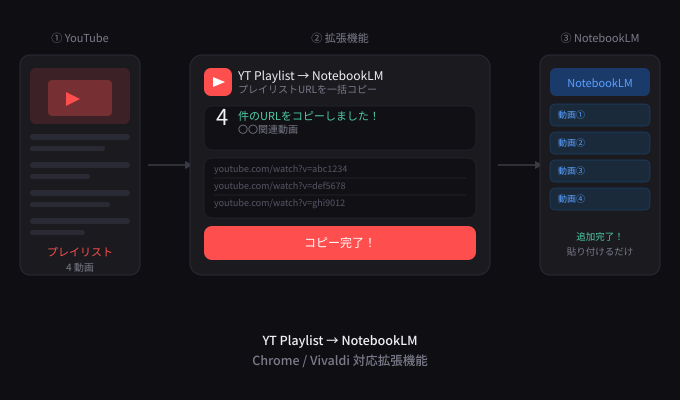

# YT Playlist → NotebookLM

**YouTubeのプレイリスト動画URLをワンクリックで一括コピー。NotebookLMにすぐ貼り付けられる Chrome / Vivaldi 拡張機能。**

One-click bulk copy of YouTube playlist video URLs — paste them straight into NotebookLM.



---

## ✨ 機能 / Features

- 📋 プレイリスト内の全動画URLを1クリックで取得・コピー
- 🔗 NotebookLMを開くボタン付き
- 🎨 ダークテーマのすっきりしたUI
- ⚡ シンプル・軽量・広告なし

---

## 🚀 インストール方法 / Installation

> Chrome Web Storeには未公開です。デベロッパーモードで手動インストールしてください。  
> Not published on the Chrome Web Store. Install manually via Developer Mode.

### Vivaldi / Chrome

1. このページの **[Releases](../../releases)** からZIPをダウンロードして解凍する
2. ブラウザのアドレスバーに以下を入力してEnter
   - Vivaldi: `vivaldi://extensions`
   - Chrome: `chrome://extensions`
3. 右上の **「デベロッパーモード」をON** にする
4. **「パッケージ化されていない拡張機能を読み込む」** をクリック
5. 解凍したフォルダ `yt-playlist-to-notebooklm` を選択して完了！🎉

---

## 📖 使い方 / How to use

1. YouTubeで **プレイリストページ** を開く
   ```
   例: https://www.youtube.com/playlist?list=PLxxxxxxxxxxxx
   ```
2. ブラウザのツールバーにある **▶ アイコン** をクリック
3. **「URLをコピーする」** ボタンを押す
4. [NotebookLM](https://notebooklm.google.com) を開いて **貼り付けるだけ**！

---

## ⚠️ 注意事項 / Notes

- YouTubeは**無限スクロール**で動画を読み込む仕様のため、**画面に表示されている動画のみ**URLを取得します。プレイリストが長い場合はページを最下部までスクロールしてから使ってください。
- YouTubeの仕様変更によって動作しなくなる場合があります。
- This extension only captures URLs of videos **currently loaded on screen**. For long playlists, scroll to the bottom of the page before clicking the button.

---

## 🛠️ 技術仕様 / Tech

- Manifest V3
- Permissions: `activeTab`, `clipboardWrite`, `scripting`
- No external dependencies

---

## 📝 ライセンス / License

MIT License

---

## 🙋 作者 / Author

**小夏 / Konatsu**

- X (Twitter): [@572nacchan](https://x.com/572nacchan)
- note: [572nacchan_log](https://note.com/572nacchan_log)

---

*フィードバック・バグ報告は [Issues](../../issues) へどうぞ！*
